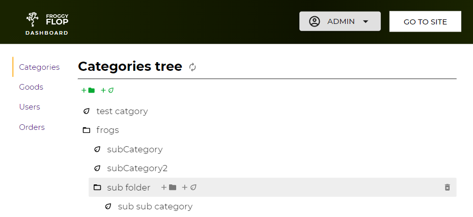
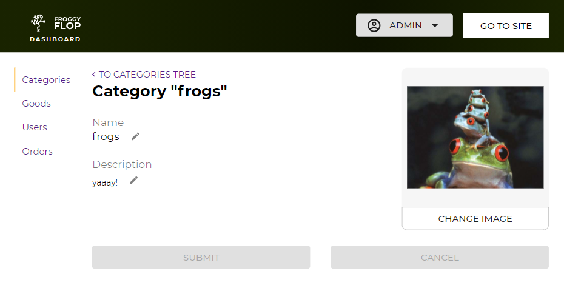
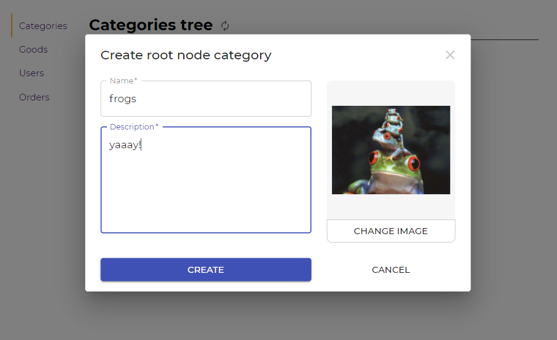
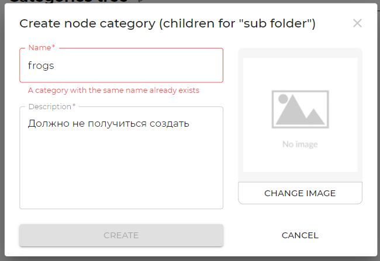

Этот проект - это клиентская часть для моего дипломного проекта (интернет-магазина).

Вот Figma макет, по котророму планируется делать сайт (https://www.figma.com/file/CxI2j9ivNWb23pv5heprFF/New-Disign?node-id=0%3A1)

На данный момент идет работа над dashboard`ом и готова только секция отвечающая за категории.

Данный клиент делает запросы на API (https://github.com/Zharrazh/RESTStoreAPI) и валидирует данные как на самом клиенте,
так и отображает ошибки, которые выдает сервер

